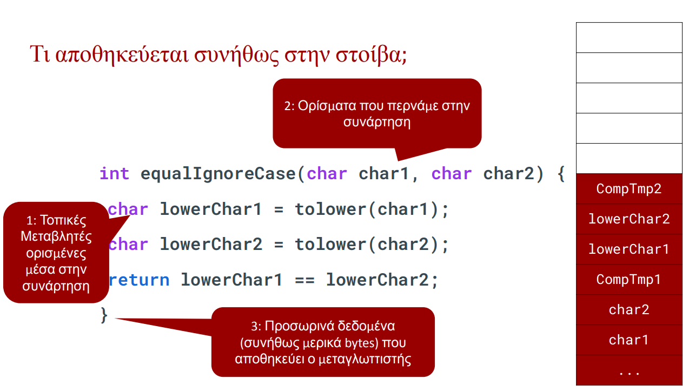
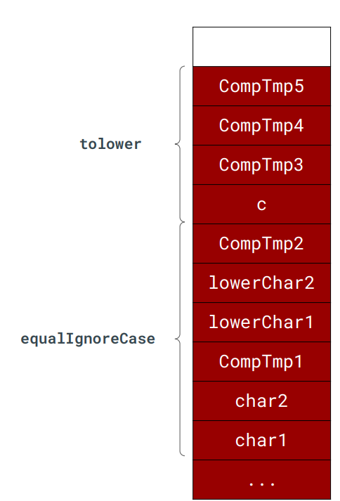
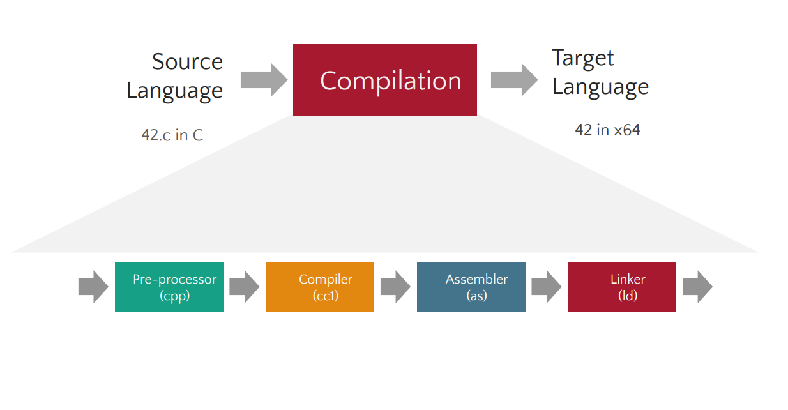

# Buffer Overflows and x86 Fundamentals

## Memory Categories

Programs typically use three major memory regions:

1. **Stack**
2. **Heap**
3. **Global / Static Memory**

---

# The Stack

The stack is a continuous memory segment where data is added and removed in **Last-In, First-Out (LIFO)** order.

## Function Stack Frame



Each function call receives its own **stack frame** (activation record).

## Nested Function Calls



When a function calls another function, a new stack frame is pushed onto the stack.

---

# Endianness

Endianness describes how multi-byte values are stored in memory.

- **Little Endian**: Least-significant byte stored first.
- **Big Endian**: Most-significant byte stored first.
- **Bi-Endian**: Can operate in either mode.

---

# Compilation Workflow



## Execution Workflow


---

# CALL and RET Semantics

## CALL

1. Push return address.
2. Jump to target function.

## RET

1. Pop return address.
2. Jump back.
3. Continue execution.

---

# Buffer Overflows

A buffer overflow occurs when data is written outside the memory allocated for a buffer.

## Types

1. Stack-based
2. Heap-based


---

# How to Add Your Photos

Create an `images` folder beside the Markdown file:

```text
lecture-folder/
├── lec2_styled.md
└── images/
    ├── stack_1.png
    ├── tolower_stack.png
    ├── compilation_pipeline.png
    ├── execution_workflow.png
    └── buffer_overflow_example.png
```

Use Markdown image syntax:

```md

```

You can also control image size in Obsidian:

```md
![[stack_1.png|600]]
```

or in GitHub-compatible HTML:

```html

```
